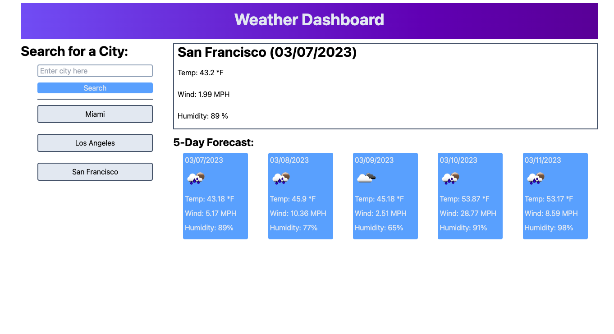

# md6-weather-dashboard

A work day scheduler powered by:

- Tailwind CSS
- jQuery
- OpenWeather API
- dayjs

[This is an external link to the weather dashboard](https://rhodemc.github.io/md6-weather-dashboard/)

## Description

I was motivated to create a weather dashboard because I feel it is a useful tool when traveling.

Using this weather dashboard allows for a city search, populating both current day weather and a five-day forecast.

When using this weather dashboard, you'll find responsive buttons and both a search history and forecast that repopulates upon refresh.

## Installation

N/A

## Usage

To enjoy this site, type in your city of interest into the search bar. Once the search button is clicked, the page will populate with both the current weather and a five-day forecast. Leaving this page or refreshing will save your previous searches, allowing for quick reference.

Future updates will see better responsive design as well as a dynamic weather icon in the current day portion of the page.

## Credits

N/A

## License

Please refer to the LICENSE in the repo.
